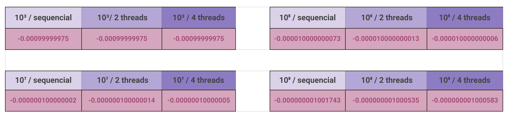
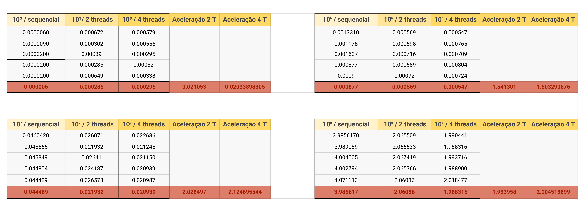

# **Laboratório 3**

## **Implementação e avaliação de aplicações concorrentes (parte 2)**

### **Atividade 1**

O código se encontra nesse repositório, em [sequencial.c](sequencial.c).

### **Atividade 2**

O código se encontra nesse repositório, em [paralelo.c](paralelo.c).

A abordagem escolhida para  paralelização do problema foi a divisão em blocos, para que sejam realizadas as somas de valores de ordem de grandeza próxima.

### Os resultados coincidem?

Com exceção do teste com 10³, não. 

### Por que?

Os resultados não coincidem pois as somas na série estão sendo realizadas em diferentes ordens.

No caso sequencial, todos os termos são somados diretamente em um acumulador, sendo esse retornado.

Já no caso paralelo, cada thread cria um bloco e realiza as somas dentro desse bloco, que serão posteriormente somadas entre si para o resultado. A criação dessas subparcelas pode causar perda de precisão em números de ponto flutuante.

No caso de 10³, provavelmente os números somados são próximos o suficiente, em termos de grandeza, para que não haja perda de precisão. Devido ao uso do tipo _double_, a precisão está sendo preservada para esta quantidade de casas decimais.

### Qual solução se aproxima mais rapidamente do valor de π?

A solução sequencial.

Como pode ser visto na tabela acima, sua diferença para π é sempre menor que a diferença da solução paralela para um dado valor de N.

### **Aceleração**

**Obs**: programa executado no notebook, que possui o processador do modelo [Intel Core i7 5500U](https://www.notebookcheck.info/Intel-Core-i7-5500U-Notebook-Processor.139031.0.html). Esse processador só possui 2 cores, e por ser um problema CPU-bound, não há ganhos significativos de aceleração quando o número de threads é maior que número de cores do processador.
