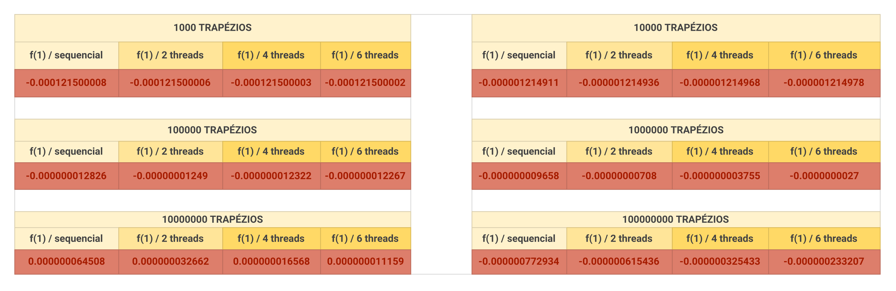
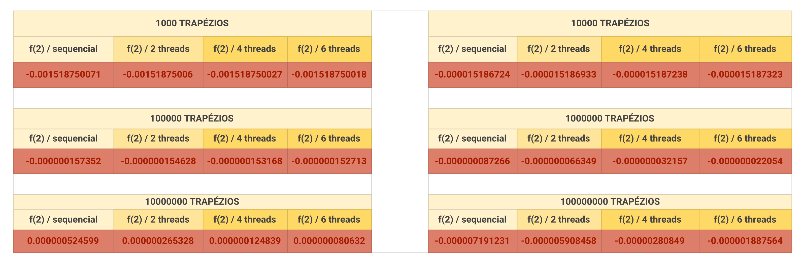
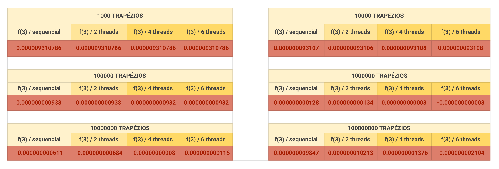
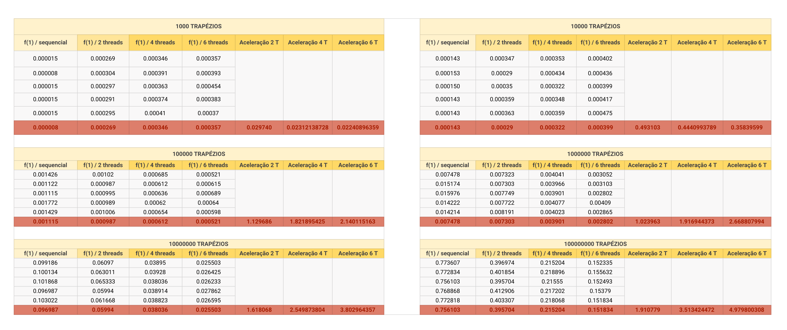
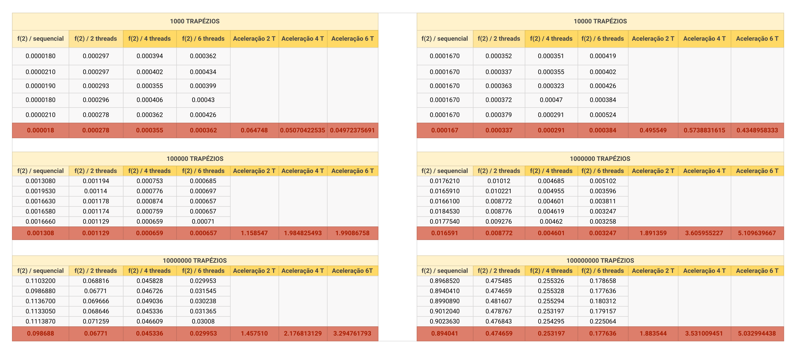
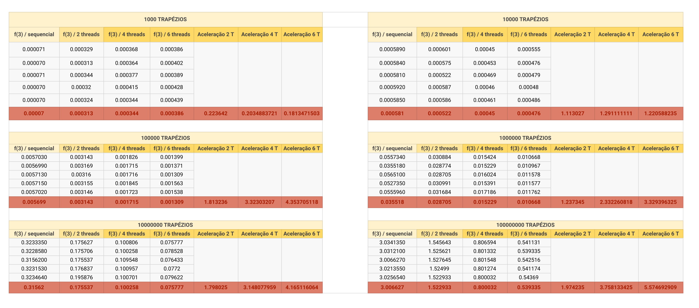

# **Módulo 1 - Trabalho de Implementação**

## **Integração numérica trapezoidal**

### **Código fonte**

O código se encontra nesse repositório, em [integra.c](integra.c).

### **O problema escolhido**

O problema selecionado foi a integração numérica através de trapézios.

O programa recebe como entrada:

* o número de trapézios para serem somados e, dessa forma, aproximarem a área da integral;
* o número de threads que realizarão as somas;
* o id da função a ser integrada;
* o limite inferior de integração;
* o limite superior de integração.

Foi escolhida a divisão em blocos para a distribuição de tarefas entre as threads.

Foi observado que se o limite superior for menor que limite inferior, a base será negativa, o que garante que o valor da integral estará correto.

### **Casos de teste**

Foram escolhidas 3 funções teste para a execução do código:

* x²
* x³ - 4x² + 3x - 12
* sen(x)

Para o teste, foram comparados dois resultados:

* No resultado esperado, foi usada a diferença entre as primitivas das respectivas funções avaliadas nos limites superior e inferior;
* No resultado calculado pela função, foi calculado pelo programa a área de cada trapézio
  * uma thread fica responsável por uma parcela de trapézios, sendo essa parcela o tamanho de cada bloco 
  * por fim, a função main realiza a soma de todas as áreas, aproximando o valor da integral

### **Corretude**

Nas funções 1, 2 e 3, o erro tende a diminuir conforme o número de trapézios aumenta.

Isso se deve a maior quantidade de seções da área sob o gráfico (trapézios), que serão posteriormente somadas, resultando em mais aproximações que o programa consegue realizar.

### **Ganho de desempenho**

Foram feitos os testes sob 3 condições distintas:

* com cada uma das funções citadas;
* com 10³, 10⁴, 10⁵, 10⁶, 10⁷ e 10⁸ trapézios;
* sequencial, com 2 threads, com 4 threads e com 6 threads.

Nas tabelas a seguir, registrei a aceleração de cada uma das funções, com cada uma das quantidades de trapézios, em relação a 2, 4 e 6 threads. Indo função por função:

### **x²**

Com 10³ e 10⁴ trapézios, não há ganho de desempenho da execução sequencial para a execução concorrente. Isso ocorre devido ao overhead de iniciar as threads, o que dominou o tempo de execução em relação à execução sequencial.

Com 10⁵, 10⁶, 10⁷ e 10⁸, é possível ver o ganho de desempenho.

### **x³ - 4x² + 3x - 12**

Assim como na primeira função, com 10³ e 10⁴ trapézios não há ganho de desempenho, provavelmente pelo mesmo motivo.

Já com 10⁵ trapézios, o ganho de desempenho entre 2 e 4 threads é expressívo, porém entre 4 e 6 não há ganho.

Com 10⁶, 10⁷ e 10⁸ é possível ver o ganho de desempenho.

### **sen(x)**

Já na terceira função, apenas não há ganho de desempenho no primeiro caso, com 10³ trapézios.

Com 10⁴ há ganho de desempenho, porém uma ligeira perda entre 4 e 6 threads.

Com 10⁵, 10⁶, 10⁷ e 10⁸ é possível ver o ganho de desempenho.

